# OpenClaw - AI 上下文文档

最后更新: 2026-01-30

> 本文档由自适应架构师自动生成。如需重新扫描，运行 `--mode analyze`。

---

## 变更记录 (Changelog)

### 2026-01-30
- 初始化项目架构分析
- 识别 31 个核心模块和 28 个扩展插件
- 生成模块结构图和索引
- 扫描覆盖率: ~25% (核心模块高覆盖率，移动应用低覆盖率)

---

## 项目愿景

**OpenClaw** 是一个个人 AI 助手，运行在你自己的设备上。它通过你已使用的渠道（WhatsApp、Telegram、Slack、Discord、Google Chat、Signal、iMessage、Microsoft Teams、WebChat）以及扩展渠道（BlueBubbles、Matrix、Zalo、Zalo Personal）回答你的问题。它可以在 macOS/iOS/Android 上说话和聆听，并可以渲染你控制的实时 Canvas。

### 核心特性
- **多渠道支持**: 内置 10+ 消息渠道，可通过扩展插件添加更多
- **AI 模型集成**: 支持 Anthropic Claude、OpenAI、Google Gemini、本地模型等
- **浏览器自动化**: 内置 Playwright 集成，支持自动化任务
- **多平台**: CLI、macOS 桌面应用、iOS/Android 移动应用、Web UI
- **插件系统**: 丰富的插件 SDK，支持自定义渠道和工具

---

## 架构总览

OpenClaw 采用模块化架构，核心是 **Gateway 服务器**（控制平面）和 **Agent 运行时**（AI 执行引擎）。

### 核心组件
1. **CLI 入口** (`openclaw.mjs` → `src/index.ts`)
   - 命令行界面，提供所有用户命令
   - 基于 Commander.js 构建

2. **Gateway 服务器** (`src/gateway/`)
   - WebSocket + HTTP 服务器
   - 管理所有连接的设备、渠道和代理
   - 提供控制 UI 和配置接口

3. **Agent 运行时** (`src/agents/`)
   - 集成 Pi Agent Core
   - 支持多种 AI 模型提供商
   - 工具调用和会话管理

4. **渠道系统** (`src/channels/` + `extensions/`)
   - 插件化渠道架构
   - 统一的消息路由和分发
   - 支持内置渠道和扩展渠道

5. **移动/桌面应用** (`apps/`)
   - Android: Kotlin + Jetpack Compose
   - iOS/macOS: Swift + SwiftUI
   - Web UI: React + Vite

---

## 模块结构图

```mermaid
graph TD
    ROOT["(根) OpenClaw"]

    ROOT --> SRC["src/"]
    ROOT --> APPS["apps/"]
    ROOT --> EXT["extensions/"]
    ROOT --> DOCS["docs/"]
    ROOT --> UI["ui/"]

    SRC --> CLI["cli/"]
    SRC --> CMDS["commands/"]
    SRC --> GW["gateway/"]
    SRC --> AGENTS["agents/"]
    SRC --> CHANNELS["channels/"]
    SRC --> CONFIG["config/"]
    SRC --> BROWSER["browser/"]
    SRC --> MEDIA["media/"]
    SRC --> PLUGIN_SDK["plugin-sdk/"]
    SRC --> ROUTING["routing/"]

    SRC --> WEB["web/"]
    SRC --> TG["telegram/"]
    SRC --> DISCORD["discord/"]
    SRC --> SLACK["slack/"]
    SRC --> SIGNAL["signal/"]
    SRC --> IMESSAGE["imessage/"]
    SRC --> LINE["line/"]

    APPS --> ANDROID["android/"]
    APPS --> IOS["ios/"]
    APPS --> MACOS["macos/"]

    EXT --> EXT_CHANNELS["渠道插件"]
    EXT --> EXT_TOOLS["工具插件"]
    EXT --> EXT_DIAG["诊断插件"]

    EXT_CHANNELS --> EXT_TG["telegram"]
    EXT_CHANNELS --> EXT_MATRIX["matrix"]
    EXT_CHANNELS --> EXT_MSTEAMS["msteams"]
    EXT_CHANNELS --> EXT_ZALO["zalo"]

    click CLI "./src/cli/CLAUDE.md" "查看 CLI 模块文档"
    click CMDS "./src/commands/CLAUDE.md" "查看 Commands 模块文档"
    click GW "./src/gateway/CLAUDE.md" "查看 Gateway 模块文档"
    click AGENTS "./src/agents/CLAUDE.md" "查看 Agents 模块文档"
    click CHANNELS "./src/channels/CLAUDE.md" "查看 Channels 模块文档"
    click CONFIG "./src/config/CLAUDE.md" "查看 Config 模块文档"
    click BROWSER "./src/browser/CLAUDE.md" "查看 Browser 模块文档"
    click ANDROID "./apps/android/CLAUDE.md" "查看 Android 应用文档"
    click IOS "./apps/ios/CLAUDE.md" "查看 iOS 应用文档"
    click MACOS "./apps/macos/CLAUDE.md" "查看 macOS 应用文档"
```



---

## 模块索引

| 模块 | 路径 | 类型 | 描述 | 状态 |
|------|------|------|------|------|
| **CLI** | `src/cli/` | 核心 | CLI 框架、命令解析器、用户交互 | ✅ 已扫描 |
| **Commands** | `src/commands/` | 核心 | CLI 命令实现 (agent, channels, configure, doctor) | ✅ 已扫描 |
| **Gateway** | `src/gateway/` | 核心 | Gateway 服务器 - 控制平面 | ✅ 已扫描 |
| **Agents** | `src/agents/` | 核心 | AI 代理运行时 - 模型集成、工具、会话 | ✅ 已扫描 |
| **Channels** | `src/channels/` | 核心 | 渠道插件系统和共享逻辑 | ✅ 已扫描 |
| **Config** | `src/config/` | 核心 | 配置加载、验证和管理 | ✅ 已扫描 |
| **Web** | `src/web/` | 核心 | WhatsApp Web 集成 (Baileys) | ✅ 已扫描 |
| **Telegram** | `src/telegram/` | 核心 | Telegram 机器人集成 | ✅ 已扫描 |
| **Discord** | `src/discord/` | 核心 | Discord 机器人集成 | ⚠️ 部分扫描 |
| **Slack** | `src/slack/` | 核心 | Slack 机器人集成 | ⚠️ 部分扫描 |
| **Signal** | `src/signal/` | 核心 | Signal 集成 | ⚠️ 部分扫描 |
| **iMessage** | `src/imessage/` | 核心 | iMessage 集成 (macOS) | ⚠️ 部分扫描 |
| **LINE** | `src/line/` | 核心 | LINE 消息集成 | ⚠️ 部分扫描 |
| **Browser** | `src/browser/` | 核心 | 浏览器自动化 (Playwright/CDP) | ✅ 已扫描 |
| **Media** | `src/media/` | 核心 | 媒体处理和理解管道 | ⚠️ 部分扫描 |
| **Plugin SDK** | `src/plugin-sdk/` | 核心 | 外部扩展的插件 SDK | ✅ 已扫描 |
| **Routing** | `src/routing/` | 核心 | 消息路由和会话密钥解析 | ✅ 已扫描 |
| **Extensions** | `extensions/` | 扩展 | 28+ 插件扩展 (渠道、提供商、工具) | ⚠️ 部分扫描 |
| **Android** | `apps/android/` | 应用 | Android 移动应用 (Kotlin) | 📁 文件级 |
| **iOS** | `apps/ios/` | 应用 | iOS 移动应用 (Swift/SwiftUI) | 📁 文件级 |
| **macOS** | `apps/macos/` | 应用 | macOS 桌面应用 (Swift/SwiftUI) | 📁 文件级 |
| **Web UI** | `ui/` | 应用 | Web UI (React/Vite) | 📁 文件级 |

图例:
- ✅ 已扫描: 完整扫描，包含入口点、接口、依赖
- ⚠️ 部分扫描: 仅扫描关键文件
- 📁 文件级: 仅扫描目录结构和入口点

---

## 运行与开发

### 环境要求
- **Node.js**: >=22.12.0
- **包管理器**: pnpm (推荐) 或 bun
- **TypeScript**: 5.9+

### 安装依赖
```bash
pnpm install
pnpm ui:build  # 首次运行时自动安装 UI 依赖
```

### 开发命令
```bash
# 构建项目
pnpm build

# 运行 CLI (开发模式)
pnpm dev
pnpm openclaw ...

# 运行 Gateway (开发模式，自动重载)
pnpm gateway:watch

# 运行 TUI
pnpm tui

# 运行测试
pnpm test
pnpm test:coverage

# 代码检查
pnpm lint
pnpm format
```

### 移动应用开发
```bash
# Android
pnpm android:run

# iOS
pnpm ios:run

# macOS 打包
pnpm mac:package
```

### 发布流程
详见 `docs/reference/RELEASING.md` 和 `docs/platforms/mac/release.md`

---

## 测试策略

### 测试框架
- **Vitest**: 单元测试和集成测试
- **覆盖率阈值**: V8 (70% 行/分支/函数/语句)
- **测试位置**: 与源文件并置 (`*.test.ts`)
- **E2E 测试**: `*.e2e.test.ts`

### 测试分类
- **单元测试**: `src/**/*.test.ts`
- **E2E 测试**: `src/**/*.e2e.test.ts`
- **实时测试** (需要真实密钥): `CLAWDBOT_LIVE_TEST=1 pnpm test:live`
- **Docker E2E**: `pnpm test:docker:*`

### 测试覆盖
- **排除项** (通过手动/E2E 验证):
  - 入口点和连接文件
  - 某些 AI 集成
  - Gateway 服务器集成表面
  - 进程桥
  - 交互式 UI/流程
  - 渠道表面

### 运行测试
```bash
# 所有测试
pnpm test

# 覆盖率
pnpm test:coverage

# 实时测试 (需要真实密钥)
CLAWDBOT_LIVE_TEST=1 pnpm test:live

# Docker E2E
pnpm test:docker:onboard
pnpm test:docker:live-models
pnpm test:docker:live-gateway
```

---

## 编码规范

### 语言和风格
- **语言**: TypeScript (ESM)
- **格式化**: Oxfmt (`pnpm format`)
- **Linting**: Oxlint (`pnpm lint`)
- **类型检查**: 严格类型，避免 `any`

### 代码组织
- **文件大小**: 目标 ~700 LOC (指南，非硬限制)
- **函数长度**: 提取助手而不是 "V2" 副本
- **注释**: 为棘手或非显而易见的逻辑添加简短注释
- **命名**:
  - 产品/应用/文档标题: **OpenClaw**
  - CLI 命令、包/二进制、路径、配置键: `openclaw`

### 依赖注入
- 使用现有的模式和 CLI 选项的 `createDefaultDeps`

### 版本位置
- `package.json` (CLI)
- `apps/android/app/build.gradle.kts` (versionName/versionCode)
- `apps/ios/Sources/Info.plist` + `apps/ios/Tests/Info.plist` (CFBundleShortVersionString/CFBundleVersion)
- `apps/macos/Sources/OpenClaw/Resources/Info.plist` (CFBundleShortVersionString/CFBundleVersion)

---

## AI 使用指引

### 词汇表
- "makeup" = "mac app"

### 多代理安全
- **不要** 创建/应用/删除 `git stash` 条目 (除非明确要求)
- **不要** 创建/删除/修改 `git worktree` 检出 (除非明确要求)
- **不要** 切换分支 (除非明确要求)
- **当用户说 "push"**: 可以 `git pull --rebase` 集成最新更改
- **当用户说 "commit"**: 仅包含你的更改
- **当用户说 "commit all"**: 分组提交所有内容

### Lint/Format 繁琐
- 如果 staged+unstaged diffs 仅是格式化，自动解决而不询问
- 如果已请求 commit/push，自动暂存并包含格式化后续
- 仅在更改是语义性的 (逻辑/数据/行为) 时询问

### Bug 调查
在得出结论前阅读相关 npm 依赖项和所有相关本地代码的源代码；以高置信度确定根本原因。

### 工具架构守卫 (google-antigravity)
- 在工具输入架构中避免 `Type.Union`
- 使用 `stringEnum`/`optionalStringEnum` (Type.Unsafe enum) 用于字符串列表
- 使用 `Type.Optional(...)` 代替 `... | null`
- 保持顶层工具架构为 `type: "object"` 带 `properties`

### 发布守卫
- 未经操作员明确同意，不要更改版本号
- 始终在运行任何 npm publish/release 步骤之前请求许可

---

## 扩展插件

### 渠道插件 (28+)
**内置渠道**:
- Telegram (`src/telegram/`)
- Discord (`src/discord/`)
- Slack (`src/slack/`)
- Signal (`src/signal/`)
- iMessage (`src/imessage/`)
- LINE (`src/line/`)
- WhatsApp (`src/web/`)

**扩展渠道** (`extensions/`):
- `telegram` - Telegram 扩展
- `discord` - Discord 扩展
- `slack` - Slack 扩展
- `signal` - Signal 扩展
- `imessage` - iMessage 扩展
- `whatsapp` - WhatsApp 扩展
- `matrix` - Matrix 支持
- `googlechat` - Google Chat 支持
- `msteams` - Microsoft Teams 支持
- `mattermost` - Mattermost 支持
- `nextcloud-talk` - Nextcloud Talk 支持
- `bluebubbles` - BlueBubbles 支持
- `line` - LINE 扩展
- `nostr` - Nostr 支持
- `twitch` - Twitch 支持
- `zalo` - Zalo 支持
- `zalouser` - Zalo User 支持
- `tlon` - Urbit 支持
- `voice-call` - 语音通话支持

**工具/提供商插件**:
- `llm-task` - LLM 任务工具
- `lobster` - UI 框架
- `copilot-proxy` - GitHub Copilot 代理
- `google-antigravity-auth` - Google Antigravity 认证
- `google-gemini-cli-auth` - Google Gemini CLI 认证
- `diagnostics-otel` - OpenTelemetry 诊断
- `memory-core` - 记忆核心
- `memory-lancedb` - LanceDB 记忆存储
- `open-prose` - 开放散文

### 插件开发
- **SDK**: `src/plugin-sdk/`
- **文档**: `docs/concepts/architecture.md`
- **示例**: 参考现有扩展

---

## 渠道和路由

### 渠道类型
- **消息渠道**: 双向消息传递 (Telegram, Discord, Slack, WhatsApp, Signal, iMessage, LINE)
- **群组渠道**: 群组消息和提及处理
- **语音渠道**: 语音输入输出 (移动应用)

### 路由系统
- **路由键**: `src/routing/session-key.ts`
- **路由解析**: `src/routing/resolve-route.ts`
- **消息路由**: 基于 `accountId`, `channelId`, `peerId`

### 渠道配置
- **配置架构**: `src/config/types.channels.ts`
- **配置验证**: `src/config/schema.ts`
- **渠道注册**: `src/channels/registry.ts`

---

## 关键文件

### 入口点
- `openclaw.mjs` - CLI 入口
- `src/index.ts` - 主入口
- `src/entry.ts` - 构建入口

### 配置
- `package.json` - NPM 包配置
- `tsconfig.json` - TypeScript 配置
- `vitest.config.ts` - Vitest 配置

### 文档
- `README.md` - 项目 README
- `CHANGELOG.md` - 变更日志
- `CLAUDE.md` - 本文档

---

## 覆盖率与缺口

### 当前覆盖率
- **总文件数**: ~3500
- **已扫描**: ~890 (25%)
- **核心模块**: 高覆盖率 (70-90%)
- **移动应用**: 低覆盖率 (仅文件级)
- **扩展插件**: 中等覆盖率 (关键文件)

### 主要缺口
1. **移动应用深度扫描**:
   - `apps/android/` - 需要完整架构扫描
   - `apps/ios/` - 需要完整架构扫描
   - `apps/macos/` - 需要完整架构扫描

2. **扩展插件详细扫描**:
   - 每个扩展的完整架构
   - 插件间依赖关系

3. **文档结构扫描**:
   - `docs/` 内容结构
   - 交叉引用完整性

### 下一步建议
1. 深度扫描 `apps/android` 获取完整架构
2. 深度扫描 `apps/ios` 获取完整架构
3. 深度扫描 `apps/macos` 获取完整架构
4. 详细扫描每个扩展插件
5. 扫描 `docs/` 获取内容结构

---

## 相关链接

- **仓库**: https://github.com/openclaw/openclaw
- **文档**: https://docs.openclaw.ai
- **DeepWiki**: https://deepwiki.com/openclaw/openclaw
- **Discord**: https://discord.gg/clawd

---

*本文档由自适应架构师自动生成。最后扫描: 2026-01-30 18:59:27 CST*
